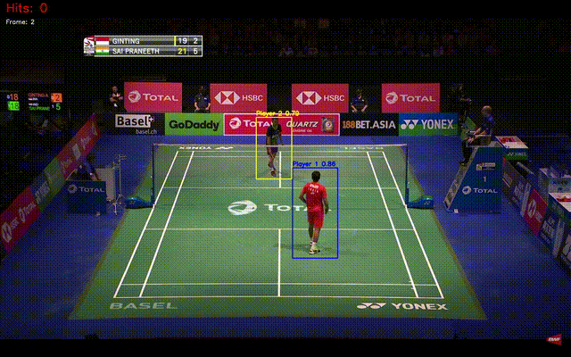

# Badminton Match Analysis with YOLOv8

This project provides an end-to-end pipeline for analyzing badminton match videos using computer vision. It detects players and shuttle, counts hits, determines rally winners, and generates a post-match summary overlay at the end of the video.

## Features
- Player and shuttle detection using YOLOv8
- Hit counting and rally segmentation
- Automatic rally winner prediction
- Clean video overlays (hit count, winner, post-match summary)
- Easy-to-use, single-script workflow

## Demo


## Setup
1. Clone the repo and navigate to the project directory.
2. Install dependencies:
   ```bash
   pip install -r requirements.txt
   ```
3. Download or place your trained YOLOv8 weights as `best.pt` in the project root.
4. Place your input video in the `videos/` folder.

## Usage
Edit the video path at the top of `yolo_video_hit_overlay_rallyend.py`:
```python
video_path = 'videos/your_video.mp4'
```
Run the script:
```bash
python yolo_video_hit_overlay_rallyend.py
```
- The output video with overlays will be saved in `yolo_overlay_videos/new_outputs/`.
- At the end of the video, a black screen with summary stats will be shown.

## Creating a GIF Demo
To create a GIF from your output video, use:
```bash
ffmpeg -i path/to/output_video.mp4 -vf "fps=10,scale=640:-1:flags=lanczos" -t 8 demo.gif
```
- Adjust `-t 8` to set the GIF duration (in seconds).
- Upload `demo.gif` to your repo and reference it in the README.

## Files
- `yolo_video_hit_overlay_rallyend.py` — Main script for end-to-end analysis
- `requirements.txt` — Python dependencies
- `README.md` — This file
- `badminton_data.yaml` — (Optional) Sample config for YOLO training

## Notes
- Do **not** include large video files or model weights in the repo.
- For best results, use high-quality, fixed-angle match videos.

## Possible Extensions
- **Replay Detection:** Automatically detect broadcast replays (using template matching, OCR, or logo detection) and exclude them from rally/hit analysis for more accurate stats.
- **Player Movement Heatmaps:** Visualize player movement and court coverage over the course of a match.
- **Shot Type Classification:** Classify shots (smash, drop, clear, etc.) using action recognition models.
- **Serve/Receive Detection:** Automatically identify serves and receives to segment rallies more precisely.
- **Web App or GUI:** Build an interactive interface for uploading videos and viewing analysis results.
- **Integration with LLMs:** Generate natural language summaries or commentary for each rally or match.
---

**Author:** Sai Praveen Bhamidipati
